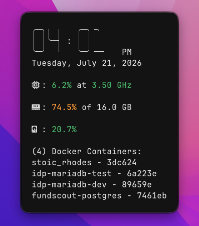

# TUI Playground

This repo contains a collection of my projects, experiments, and notes built with **Textual**
**Textual** is a Python framework for creating Terminal User Interfaces, also known as TUIs.
Subjectively, I find Textual's framework to be very visually appealling and also quick to get off the ground when programming TUIs.

## Project Gallery

[**Jarvis: System Info Monitor**](https://github.com/ardiahm/tuis/tree/main/jarvis)

*I've only completed one project so far... Stay tuned for more.*

## End Goal

I have an end goal of creating a few projects that I am so proud of, I post to the GitHub Releases and allow others to download, contribute, or leave feedback!
